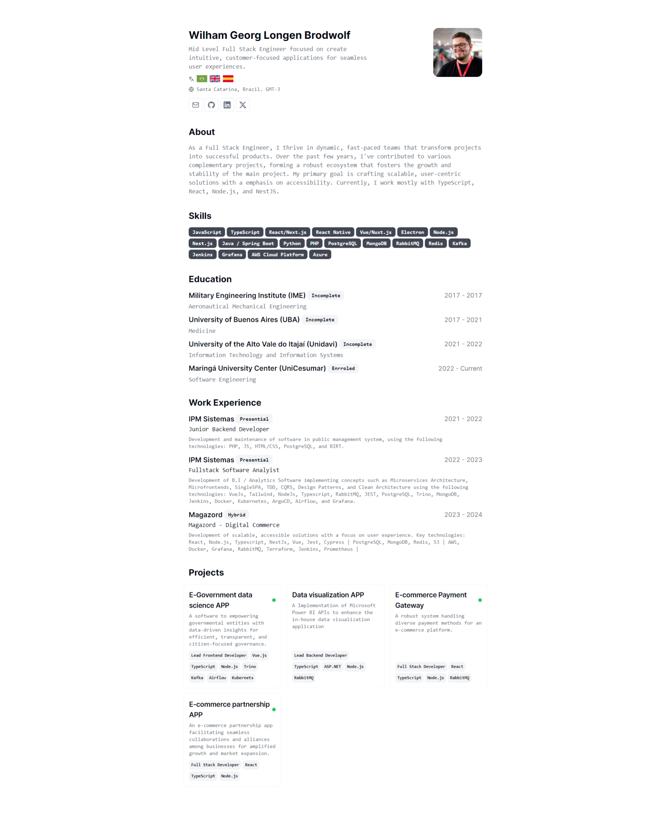

# Minimalist CV


Simple web app that renders minimalist CV with print-friendly layout.

Built with Next.js and shadcn/ui, deployed on Vercel.




  ! 

## 💻 Requirements
Node 20 ([How to install nodejs](https://nodejs.org/en/learn/getting-started/how-to-install-nodejs))


## 👀 Overview
📦 Ready out of the box  
🎯 inspired by [shadcn/ui](https://ui.shadcn.com/)
🌱 Easily extendable and customizable  
🖥 Easy to deploy on Vercel, Render and other plataforms

## 🛫 Quick Setup
```sh
# clone the project
git clone https://github.com/brodwolf/cv

# enter the project directory
cd printable-cv-template

# install dependency
npm install

# run locally
npm run dev
```

## 💻 Deploy with Vercel
[](https://vercel.com/new/)

### Alternative providers
- [Netlify](https://www.netlify.com)
- [Heroku](https://www.heroku.com)
- [Render](https://render.com)
- [Digital Ocean](https://www.digitalocean.com)
